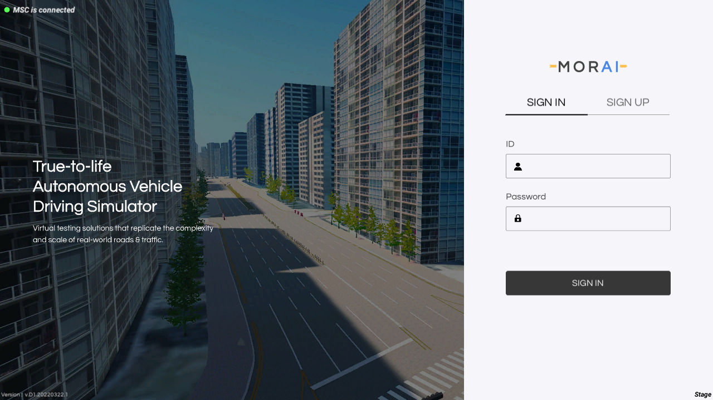

[](https://www.morai.ai)
===
# MORAI - Robotics example

 MORAI Sim: Robotics
```
./
├── AD                        # [Autonomous Drive] Trajectory following example project
│    ├── autonomous_driving     # Algorithm scripts
│    ├── ros                    # ROS1 interface scripts
│    └── udp                    # UDP interface scripts
├── EgoCtrl                   # Simulator control scripts to launch the SLAM examples
├── SLAM                      # SLAM example projects
│    ├── LeGO-LOAM              # LeGO-LOAM based 3D SLAM example with ROS1 interface
│    └── OGM                    # Occupancy Grid Mapping based 2D SLAM example with ROS1 interface
├── docker                    # Other scripts to manage the docker image
├── msgs                      # ROS1 message files to play examples
├── config.yaml               # Configure file to launch the SLAM example
└── runner.sh                 # SLAM example launcher script
```

- AD(Autonomous Drive)
  - Trajectory follower
  - ROS / UDP communication
  - Smart(adaptive) Cruise Control

- SLAM
  - LeGO-LOAM - multi channel lidar based 3D SLAM
  - OGM(Occupancy Grid Map) - single channel lidar based 2D SLAM

# Requirement

- ROS1 desktop-full >= melodic

- python >= 3.7

- niet

- tmux

# Installation

## Native Linux Environment
Basically need packages
```
$ sudo pip install niet
$ sudo apt install tmux
```
### ROS interface
```
$ mkdir -p ~/catkin_ws/src
$ cd ~/catkin_ws/src && catkin_init_workspace
$ git clone https://github.com/MORAI-Autonomous/MORAI-RoboticsExample.git
$ cd ~/catkin_ws
$ rosdep install --from-paths . --ignore-src -r -y
$ find -name 'requirements.txt' | xargs -L 1 sudo pip install -U -r
$ catkin_make
$ source devel/setup.bash
```

### UDP interface
```
$ git clone https://github.com/MORAI-Autonomous/MORAI-RoboticsExample.git
$ cd MORAI-RoboticsExample
$ find -name 'requirements.txt' | xargs -L 1 sudo pip install -U -r
```

## Docker
```
$ git clone -b docker --single-branch https://github.com/MORAI-Autonomous/MORAI-RoboticsExample.git
$ cd MORAI-RoboticsExample
$ sudo ./docker-install.sh
```

# Usage

## AD with ROS
Follow this step if you want to change the trajectory.
```
$ roslaunch morai_standard path_maker.launch
```

Enjoy the example which follow the trajectory with smart cruise control.
```
$ roslaunch morai_standard morai_standard.launch
```

## AD with UDP
```
$ cd AD/udp
```
Follow this step if you want to change the trajectory.
```
$ python3 ./path_maker.py
```

Enjoy the example which follow the trajectory with smart cruise control.
```
$ python3 ./main.py
```

## SLAM with ROS
At the first, you should write your account information to the config.yaml

assume that the account is EXAMPLE_ID / EXAMPLE_PASSWD
```
>>> config.yaml
...
  ########### User setting ############
  user_id: 'EXAMPLE_ID' # User ID
  user_pw: 'EXAMPLE_PASSWD' # User Password
...
```
Check these parameters to change the modes
- `mapping` : set the mapping mode
  - `3d` (default) : use the LeGO-LOAM algorithm
  - `2d` : use the OGM algorithm
  - `none` : do not process the mapping algorithm
- `moving` : set the Ego vehicle control mode
  - `cruise` (defualt) : use the simulator built-in auto drive mode
  - `auto` : use the external control algorithm with ROS or UDP
  - `keyboard` : just control with keyboard and your hands

and then, excute the runner.sh
```
$ ./runner.sh
```

## Docker

### launch
`MORAI-RoboticsExample` supports to setup conditions automatically, but `MORAI-SIM` needs to be installed and be running at least until the login screen, which is shown below.


# License
- MORAI AD / OGM License info:  [AD / OGM License](./docs/License.md)
- LeGO-LOAM License info:  [LeGO-LOAM License](./SLAM/LeGO-LOAM/LICENSE)
